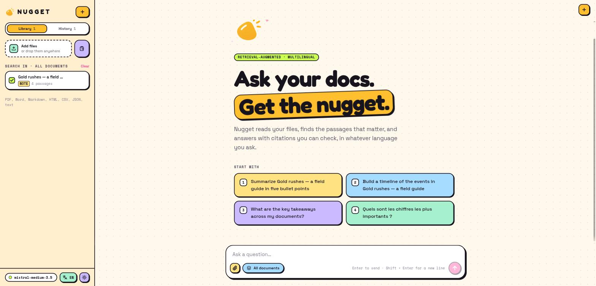
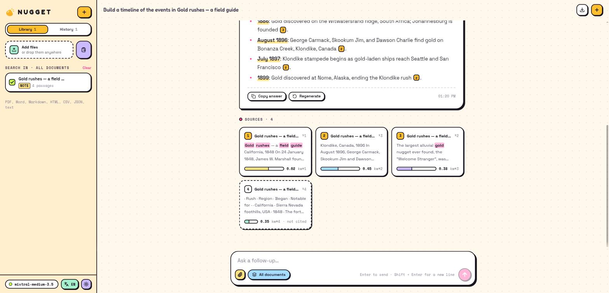
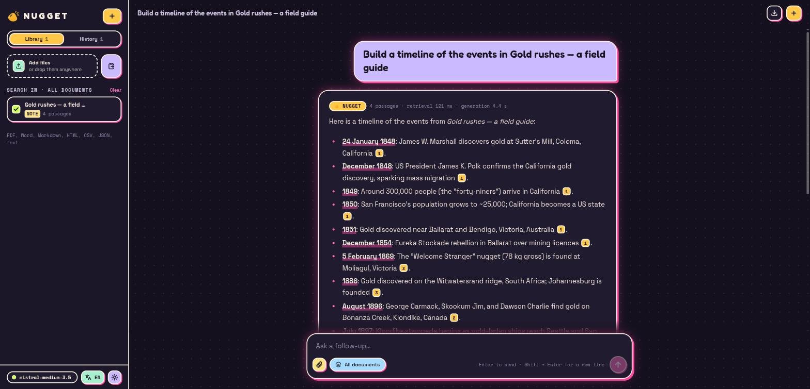

<div align="center">

<picture>
  <source media="(prefers-color-scheme: dark)" srcset="docs/logo-dark.png">
  
</picture>

### ask your docs · get the nugget

A multilingual RAG interface: drop files, ask in any language, get streamed answers with citations you can click.


**Frontend** · [Backend →](https://github.com/colombefioren/NUGGET--BACKEND)



<table><tr>
<td></td>
<td></td>
</tr></table>

</div>

## ✦ What's inside

- **Streaming answers** over SSE, with a live pipeline tracker (rewrite → search → write)
- **Clickable `[n]` citations**: hover to preview, click to jump to the exact passage
- **Library**: drag-and-drop anywhere, paste text, choose which docs to search
- **Local-first**: chats, library, scope, theme and language live in `localStorage`, and any chat exports to Markdown
- **9 languages** (EN FR ES DE PT IT 日本語 中文 العربية) with full RTL
- **Pastel neon brutalism**: ink outlines, hard shadows, neon glow in dark mode, spring animations, responsive down to phones

## ✦ Run it

```bash
npm install
npm run dev          # http://localhost:3000
```

Needs the [Nugget API](https://github.com/colombefioren/NUGGET--BACKEND) running. `/api/*` is proxied to `NUGGET_API_URL` (default `http://localhost:8000`).

## ✦ Keys

`/` focus · `Ctrl/⌘ K` new chat · `Esc` stop · `Shift ⏎` new line

<div align="center"><sub>made with 🟡 by <a href="https://github.com/colombefioren">colombefioren</a></sub></div>
